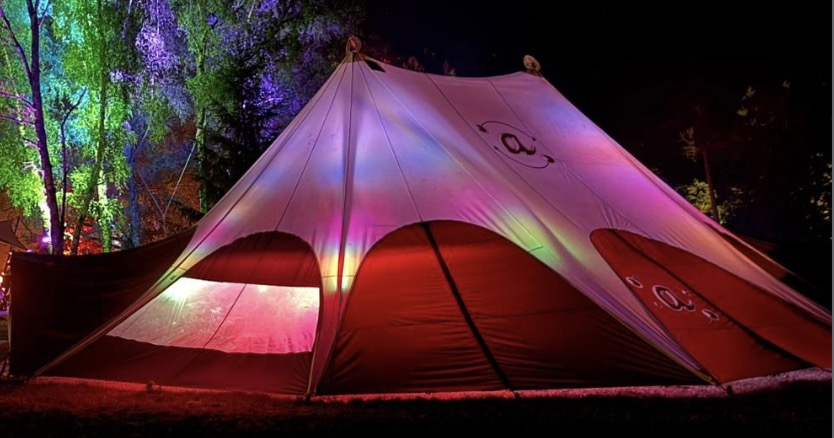

# Spinning@ Diamonds

## Resources
[ESP32 Stepper Motor Example](https://randomnerdtutorials.com/stepper-motor-esp32-web-server/)
[Accel stepper tutorial](https://www.pjrc.com/teensy/td_libs_AccelStepper.html)

## Overview
One of the big names in the UK circus scene, Spinning@, have their own tent that they take around to festivals. Inside, they’ve built an LED setup made up of layers of 2D RGB diamonds, with extra strips hanging down from the frame.

The original idea was for the installation to have a kinetic element, so the diamonds could move up and down independently. Since each diamond is fixed to the tent at its four corners, they can be lifted flat or tilted at different angles.

This project is about adding stepper motors to the wires holding each diamond, bringing that kinetic element to life and taking the installation to its next stage.

The Spinning@ Tent|The diamond|
:-:|:-:|
|

## The Plan
I intend to make a mockup version that I can demo to people before fully committing. The mockup will use 2020 aluminium extrusion as a frame which will support a much simpler version of the LEDs. These LEDs will be controlled by wled running off their own ESP32 controller. The various sections of leds will be attached to a stepper motor via a pulley system, it's these stepper motors that will control the height of each diamond. The full version will have 4 stepper motors ber diamond allowing them to sit at different angles

The LEDs will be the easiest part of the project as I've got loads of experience with that sort of thing. Making them kinetic, however, will be much harder.
